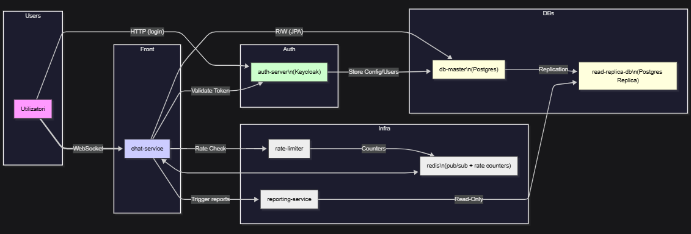

# The Imitation Game (Joc de identificare a AI-ului în camere de chat)

## 1. Descrierea Proiectului

Proiectul constă în dezvoltarea unei platforme web distribuite de tipul joc unde utilizatorii intră în chat room-uri de 7 persoane. Scopul este ca, în decurs de mai multe runde de 2 minute, participanții să identifice și să voteze care dintre cele 7 persoane este, de fapt, un program AI. Dupa fiecare runda persoana cu cele mai multe voturi este eliminata si nu mai poate interactiona cu ceilati, putand doar sa observe cum se termina jocul. De asemenea, utilizatorii pot vedea diferite statstici legate de sesiunea lor de joc si in general a jucatorilor. Aplicația trebuie să fie performantă, scalabilă și să respecte arhitectura microserviciilor.

## 2.  Arhitectura Soluției (Containere/Servicii)

Întreaga soluție va fi livrată ca un **Stack Docker Swarm**, constând din 7 servicii principale.

| \# | Serviciu (Container) | Modul | Tehnologie/Stack | Replicare |
| :--- | :--- | :--- | :--- | :--- |
| **1** | **auth-server** | Autentificare | Keycloak (Open-Source) | Nu |
| **2** | **db-master** | Baza de Date Principală (Obligatoriu) | PostgreSQL | Nu |
| **3** | **read-replica-db** | Raportare | PostgreSQL | Nu |
| **4** | **chat-service** | Aplicație Web & Logica de Bază | Java Spring Boot (cu WebSockets) | **Da** |
| **5** | **rate-limiter** | Funcționalitate Avansată | Java Spring Boot | Nu |
| **6** | **reporting-service** | Funcționalitate Avansată | Java Spring Boot | Nu |
| **7** | **redis** | Suport Rate-Limiting | Redis (Open-Source) | Nu |

## 3. Descrierea Funcționalităților Platformei

### 3.1. Funcționalități de Bază

| Categoria | Funcționalitate | Detalii de Implementare |
| :--- | :--- | :--- |
| **Autentificare** | Single Sign-On (SSO) | Autentificare și autorizare prin **Keycloak** (OAuth/SAML). Token-urile de acces vor fi validate de către `chat-service`. |
| **Managementul Rolurilor/Profil** | Profil Utilizator | `chat-service` preia meta-datele de la Keycloak și creează/actualizează profilurile utilizatorilor în `db-master` folosind un ORM (**JPA/Hibernate**). Roluri: Jucător, AI, Administrator. |
| **Logica de Joc și Baza de Date** | Starea Camerei | `chat-service` gestionează crearea camerei, alocarea rolului de AI și pornește timer-ul. Datele persistente (profiluri, loguri de chat) sunt stocate în `db-master`. |
| **Comunicare** | Chat în Timp Real | Conexiuni bazate pe **WebSockets** (implementare Spring Boot) pentru comunicare rapidă și concurentă. |

### 3.2. Funcționalități Avansate

| \# | Funcționalitate Avansată | Modul Propriu Implicat | Demonstrarea Conceptului SCD |
| :--- | :--- | :--- | :--- |
| **1** | **Generarea Rapoartelor folosind Read Replicas** | `reporting-service` | Pentru a preveni supraîncărcarea `db-master` (Write Master), `reporting-service` extrage rapoarte complexe (ex: rata de succes a jucătorilor, performanță AI) citind exclusiv de pe **`read-replica-db`**. |
| **2** | **Sistem de Rate-Limiting Distribuit** | `rate-limiter` | Protejează sistemul împotriva atacurilor de tip DoS (spam de mesaje). Funcționalitatea este implementată într-un serviciu separat (`rate-limiter`) care folosește **Redis** pentru a stoca contoarele de request-uri pe utilizator. Acesta asigură o filtrare corectă chiar și atunci când cererile ajung pe replici diferite ale `chat-service`. |

## 4. Diagrama de Arhitectură

**Interconectarea Componentelor:**
* Rețelele vor fi configurate pentru a permite comunicarea doar între serviciile interconectate (ex: `chat-service` poate vorbi cu `db-master`, dar nu și cu `reporting-service` direct).